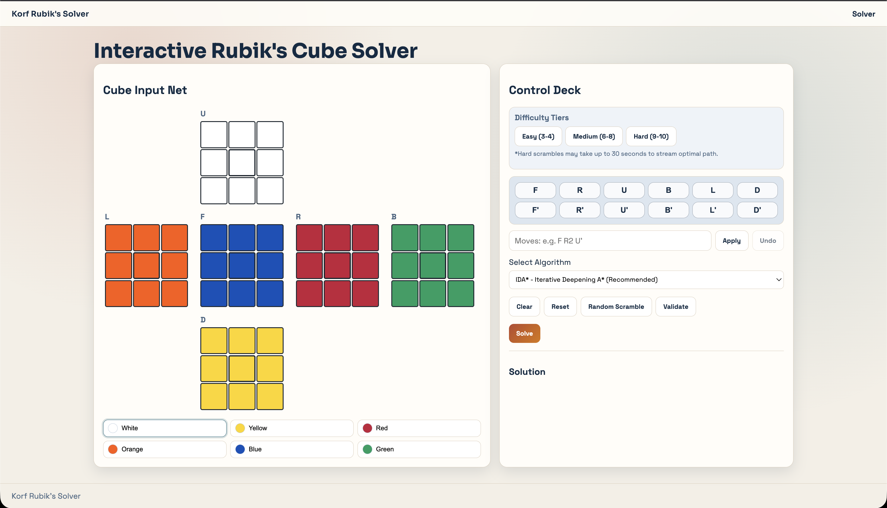
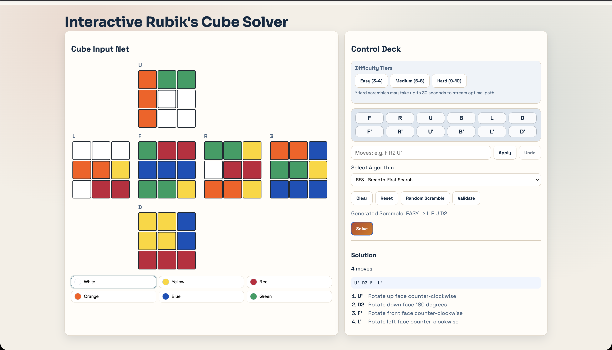
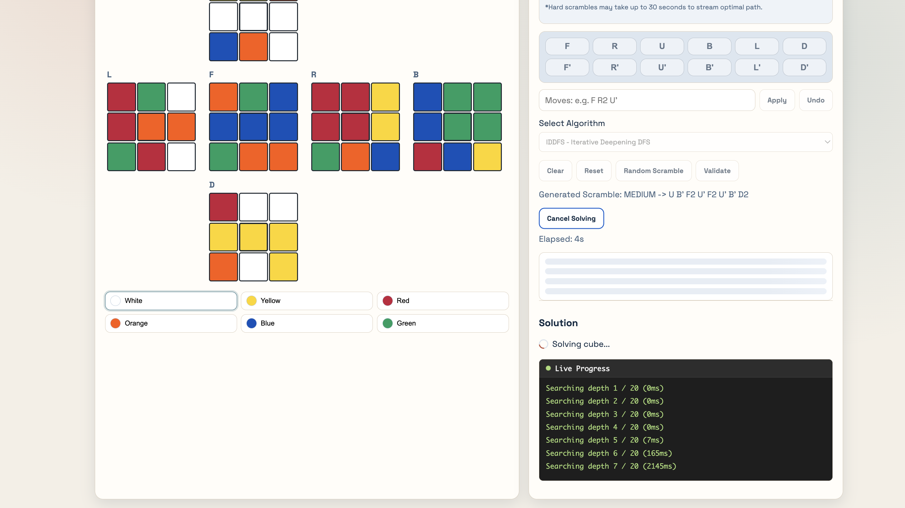
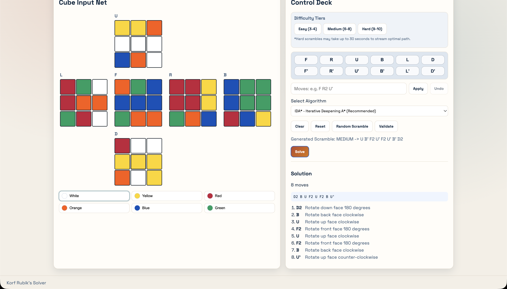
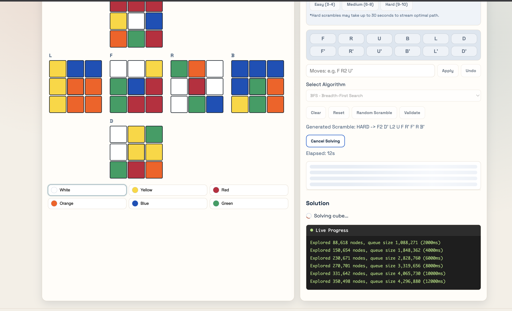

<div align="center">
  <h1>Rubik's Cube Real-Time Solver (Korf's IDA*)</h1>
  <p>A high-performance, full-stack application demonstrating Real-Time WebSockets, C++ Subprocess Inter-Process Communication (IPC), and Containerized Orchestration.</p>
</div>

<br />

<div align="center">
  
</div>

<br />

## 1. Overview

This project is an interactive Rubik's Cube solver engineered to demonstrate systems architecture and high-performance computing within a modern web environment. 

The core application integrates a highly optimized native C++ Iterative Deepening A* (IDA*) algorithm with a FastAPI Python backend. The system streams real-time internal search metrics—including node generation rates and heuristic bounds—over WebSockets to a responsive React frontend interface.

<div align="center">
  
  
</div>

## 2. Key Architectural Features

* **Real-Time WebSocket Streaming:** The C++ search tree progress is piped synchronously via standard output (stdout) to the Python backend. The backend subsequently broadcasts these metrics instantly to the React UI via a persistent WebSocket connection.
* **Process Lifecycle Management:** The backend architecture actively monitors for client WebSocket disconnections. In the event of a premature client termination, the backend intercepts the `WebSocketDisconnect` exception and issues a `SIGKILL` to the underlying C++ subprocess, guaranteeing the prevention of memory leaks or runaway CPU exhaustion.
* **Algorithmic Boundary Constraints:** The API generation endpoints safely limit scramble depths to mathematically verifiable boundaries. This prevents computational Denial of Service (DoS) scenarios and ensures consistent latency profiles for end users.
* **Containerized Deployment:** The entire full-stack environment—comprising React, Python, and the necessary C++ build toolchains—is encapsulated within Docker containers, eliminating manual dependency configuration.

<div align="center">
  
</div>

## 3. Technology Stack

| Component | Technology | Purpose |
|-----------|------------|---------|
| **Frontend** | React 19, Vite, Vanilla CSS | Interactive 2D Cube Net, WebSockets integration, Dynamic UI/UX rendering. |
| **Backend** | FastAPI, Python 3.12, Uvicorn | Asynchronous task orchestration, RESTful endpoints, WebSocket routing, Subprocess IPC management. |
| **Core Logic** | C++17, GCC | High-speed IDA* and IDDFS heuristic search algorithms capable of evaluating millions of nodes per second. |
| **DevOps** | Docker, Docker Compose | Multi-stage builds, automatic C++ compilation, deterministic deployment. |

## 4. Quick Start (Docker)

The recommended method for deployment is via Docker Compose. The orchestration automatically provisions Node.js, Python, and the required C++ build essentials.

```bash
# Clone the repository
git clone https://github.com/Divyang73/korf-Rubiks.git
cd korf-Rubiks

# Build the C++ algorithms and launch the Full-Stack app
docker-compose up --build
```

- **Frontend Application:** `http://localhost:5173`
- **Backend API Documentation (Swagger):** `http://localhost:8000/docs`

## 5. Manual Installation (Local Development)

To run the environments manually without Docker virtualization:

### 5.1 Build the C++ Solvers
A C++ compiler (`g++` or `clang`) with C++17 support is required.
```bash
cd app/backend/solvers
bash build_cpp_solvers.sh
```

### 5.2 Start the FastAPI Backend
```bash
cd app/backend
python -m venv venv
source venv/bin/activate
pip install -r requirements.txt
python server.py
```

### 5.3 Start the React Frontend
```bash
cd app/frontend
npm install
npm run dev
```

## 6. Algorithmic Implementations

The native C++ backend exposes four distinct search algorithms:
1. **Breadth-First Search (BFS):** Guarantees an optimal path but exhibits exponential memory consumption. Operationally restricted to shallow computational depths.
2. **Depth-First Search (DFS):** Optimized for speed but produces non-optimal solution paths. Evaluates deep state branches without memory overhead.
3. **Iterative Deepening DFS (IDDFS):** Combines the optimal pathing of BFS with the memory efficiency profiles of DFS.
4. **Iterative Deepening A* (IDA*):** The primary production algorithm. Utilizes a pre-computed 50MB Corner Pattern Database heuristic to aggressively prune redundant branches in the search tree.

> **Performance Considerations for IDA*:** The integrated pattern database is strictly restricted to corner permutations up to a depth of 9. Due to the absence of edge-based heuristics, deep scrambles ($\ge$ 11 moves) exhibit an exponential increase in node evaluation requirements. The scramble generation API explicitly caps operational depths to 10 moves to ensure execution completes deterministically within a 30-second service level objective.

<div align="center">
  
</div>

## 7. References
- Korf, R. E. (1985). Depth-first iterative-deepening: An optimal admissible tree search. *Artificial Intelligence*, 27(1), 97-109.
- Upstream Base C++ Implementation: [Rubiks-Cube-Solver-Using-Korfs-IDA-Algo](https://github.com/piyush932/Rubiks-Cube-Solver-Using-Korfs-IDA-Algo)
